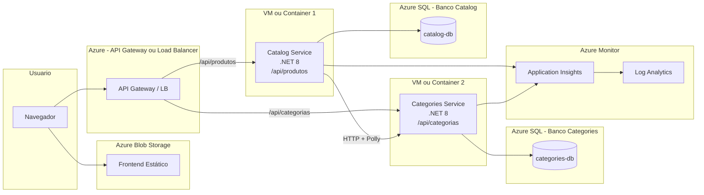

# Diagramas — TechStore Cloud

## 1. Arquitetura Atual (Monólito Modular)

```mermaid
graph LR
    subgraph Usuario
        Browser[Navegador]
    end

    subgraph Azure Blob Storage
        Frontend[Frontend Estático<br>HTML/CSS/JS]
    end

    subgraph Azure VM - Ubuntu
        Nginx[Nginx<br>Reverse Proxy<br>:80]
        subgraph API .NET 8 - Porta 5000
            Host[Program.cs<br>Middlewares / CORS / Swagger]
            subgraph Módulo Categories
                CatEndpoints[/api/categorias]
                CatDbContext[CategoriesDbContext<br>schema: categories]
                CatLookup[CategoryLookupService<br>implements ICategoryLookup]
            end
            subgraph Módulo Catalog
                ProdEndpoints[/api/produtos]
                ProdDbContext[CatalogDbContext<br>schema: catalog]
            end
            Shared[TechStore.Shared<br>ICategoryLookup / PagedResult]
        end
    end

    subgraph Azure SQL Database
        DB[(techstoredb<br>schemas: catalog, categories)]
    end

    subgraph Azure Monitor
        AppInsights[Application Insights]
        LogAnalytics[Log Analytics<br>Workspace]
    end

    Browser -->|HTTP| Frontend
    Browser -->|API calls| Nginx
    Nginx -->|proxy_pass| Host
    Host --> CatEndpoints
    Host --> ProdEndpoints
    ProdEndpoints -.->|ICategoryLookup| CatLookup
    CatDbContext --> DB
    ProdDbContext --> DB
    Host -->|Serilog + Telemetria| AppInsights
    AppInsights --> LogAnalytics
```

## 2. Evolução Futura — Microsserviços



### O que muda na evolução

| Aspecto | Monólito Modular (Atual) | Microsserviços (Futuro) |
|---------|--------------------------|------------------------|
| Deploy | Um artefato, uma VM | Artefatos separados, VMs ou containers separados |
| Comunicação inter-módulo | In-process (ICategoryLookup) | HTTP com retry/circuit breaker |
| Banco de dados | Um banco, schemas separados | Bancos separados |
| Consistência | Transacional (mesmo banco) | Eventual (Saga pattern) |
| Observabilidade | Serilog + 1 App Insights | Tracing distribuído + App Insights por serviço |
| Escalabilidade | Vertical (VM maior) | Horizontal (mais instâncias por serviço) |

## Checklist de Ícones Azure para draw.io

Ao redesenhar estes diagramas no draw.io com ícones oficiais da Azure, use:

- [ ] **Azure Blob Storage** — ícone de Storage Account / Blob Storage
- [ ] **Azure Virtual Machine** — ícone de Virtual Machine (Linux)
- [ ] **Azure SQL Database** — ícone de SQL Database (não SQL Server genérico)
- [ ] **Application Insights** — ícone de Application Insights (dentro de Monitor)
- [ ] **Log Analytics** — ícone de Log Analytics Workspace
- [ ] **Azure Monitor** — ícone guarda-chuva do Monitor
- [ ] **NSG (Network Security Group)** — ícone de NSG na VM
- [ ] **Resource Group** — contêiner visual agrupando todos os recursos
- [ ] **Nginx** — ícone genérico de web server (não é recurso Azure)
- [ ] **.NET** — ícone genérico de aplicação/API

Para baixar os ícones: pesquise "Azure architecture icons" no site da Microsoft. O pacote SVG oficial é gratuito e compatível com draw.io.
